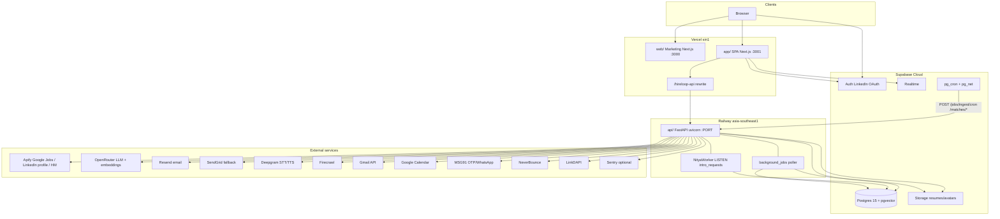

# 01 — System Map

Leadership audit of deployable surfaces, communication paths, and external integrations as implemented in the repository. Claims are grounded in code and config only.

**Active production topology (as configured in-repo):** Vercel (`app`) + Railway (`api`) + Supabase (Postgres/Auth/Storage/Realtime). AWS ECS / Cloudflare Terraform exists under `infra/` but is not the wired primary deploy path (see Discrepancies).

---

## Mermaid architecture

---

## Deployable components

| Component | Role | Deploy target | Entry point | Port / notes |
|---|---|---|---|---|
| Marketing site | Public marketing pages | Implied Vercel (no dedicated `web/vercel.json`; root `vercel.json` builds **app**) | `web/src/app/layout.tsx`, `web/src/app/page.tsx` | Dev `pnpm --filter web dev` → **3000** |
| Product SPA | Candidate + recruiter UI | **Vercel** project `hireloop1-app`, region `sin1` (`app/vercel.json`, `.vercel/project.json`) | `app/src/app/layout.tsx`; session middleware `app/src/middleware.ts` | Dev **3001**; prod rewrite `/hireloop-api/*` → Railway (`app/next.config.mjs`) |
| FastAPI API | REST + agents + in-process workers | **Railway** service `hireloop1`, region `asia-southeast1-eqsg3a`, 1 replica (`api/railway.toml`, `api/railway.json`, `api/railway.ts`) | `api/src/hireloop_api/main.py` → `app = FastAPI(...)`; run via `api/Dockerfile` → `uvicorn hireloop_api.main:app` | `$PORT` / local **8000**; workers=1 |
| Nitya LISTEN worker | Wakes on `intro_requests` NOTIFY | **Same API process** (`main.py:lifespan`) | `hireloop_api.agents.nitya.agent.NityaWorker.start` | Not a separate deployable |
| Background jobs worker | Polls `background_jobs` | **Same API process** (`main.py:lifespan`) | `hireloop_api.services.background_jobs.run_background_worker` | Toggled by `background_worker_enabled` |
| Supabase Postgres | System of record + pgvector + RLS | Supabase Cloud project `blwudfxurykzyutkqkoi` (`supabase/config.toml`) | Migrations `supabase/migrations/` | Local API **54321**, DB **54322** |
| Supabase Auth | LinkedIn OIDC + email | Same Supabase project | SPA `supabase.auth.*` | — |
| Supabase Storage | Resume/avatar buckets | Same | `api/.../routes/resumes.py` upload | Private buckets |
| Supabase Realtime | UI live updates | Same | Frontend hooks (see below) | Tables published via migrations |
| pg_cron jobs | Scheduled HTTP → API / SQL cleanup | Supabase Postgres | Migrations `20240101000600_*`, `008`, `009`, `20260713100000_*` | Requires GUCs for API URL + service secret |
| AWS ECS / Cloudflare | Planned prod infra | Terraform only — **not** confirmed live | `infra/terraform/`, `infra/cloudflare/waf_rules.tf` | PHASE_TRACKER S22: not started |

---

## Communication paths

| Path | From → To | Mechanism | Code |
|---|---|---|---|
| Browser → SPA API proxy | App → Railway | HTTP rewrite `/hireloop-api/:path*` → `NEXT_PUBLIC_API_URL` | `app/next.config.mjs`; client `app/src/lib/api/base-url.ts` |
| Browser → Auth | App → Supabase | Supabase JS Auth (LinkedIn OAuth, session cookies) | `app/src/lib/supabase/client.ts`, `SignupForm.tsx` |
| SPA → Realtime | App → Supabase | `postgres_changes` on `agent_actions`, `intro_requests`, `intro_messages` | `useAgentActionsRealtime.ts`, `IntrosList.tsx`, `IntroChat.tsx` |
| pg_cron → API | Supabase → Railway | `pg_net` HTTP POST with `X-Service-Secret` | `supabase/migrations/20240101000800_jobs_ingestion_cron.sql`, `20240101000900_matching_cron.sql` |
| INTRO NOTIFY | Postgres → NityaWorker | `LISTEN intro_requests` / `pg_notify` on INSERT | Trigger in `20240101000300_intros_and_hm.sql`; consumer `NityaWorker` |
| Durable intro / ingest / embed | API enqueue → worker | Table queue `background_jobs` (`FOR UPDATE SKIP LOCKED`) | `background_jobs.enqueue_job`, `claim_next_job`, `process_job` |
| Chat streaming | App → API | SSE from Aarya LangGraph | `api/.../routes/chat.py` |
| Voice live | App → API | WebSocket (not via Vercel rewrite) | `getApiWsBaseUrl()`, `routes/voice.py` |
| Storage | API → Supabase Storage | Service-role client upload/download | `routes/resumes.py`, `background_jobs.py` |
| Direct FE DB writes | — | **None found** (SELECT + Realtime + Auth only) | Grep of `app/` / `web/` |

### API route prefixes (`main.py` router registration)

| Prefix | Module |
|---|---|
| `/api/v1/health*` | `routes/health.py` |
| `/api/v1/markets` | `routes/markets.py` |
| `/api/v1/auth/*` | `routes/auth.py` |
| `/api/v1/resumes/*` | `routes/resumes.py` |
| `/api/v1/chat/*` | `routes/chat.py` |
| `/api/v1/matches/*` | `routes/matches.py` |
| `/api/v1/jobs/*` | `routes/jobs.py` |
| `/api/v1/career/*` | `routes/career.py` |
| `/api/v1/intros/*` | `routes/intros.py` |
| `/api/v1/gmail/*` | `routes/gmail.py` |
| `/api/v1/voice/*`, `/voice-sessions/*` | `routes/voice.py`, `voice_sessions.py` |
| `/api/v1/recruiter/*` | `routes/recruiter.py` |
| `/api/v1/me/*` | `routes/me.py` |
| `/api/v1/public/*` | `routes/public_profiles.py` |
| `/api/v1/hiring-managers/*` | `routes/hiring_managers.py` |
| `/api/v1/webhooks/msg91-whatsapp` | `routes/whatsapp_routes.py` |
| `/api/v1/admin/*`, `/super-admin/*` | `routes/admin.py`, `super_admin.py` |
| kits / tailored resumes / roadmaps / mock-interview / skills | respective route modules |

---

## External services → calling modules

| Service | Purpose | Call sites (path:symbol) |
|---|---|---|
| **Apify** — `johnvc/Google-Jobs-Scraper` | Job scrape | `services/apify/jobs_scraper.py:ApifyJobsScraper.scrape`; `services/apify/job_ingester.py:JobIngester.ingest` |
| **Apify** — LinkedIn profile actor | Candidate enrichment | `services/apify/linkedin_profile_scraper.py:scrape_linkedin_profile` |
| **Apify** — HM waterfall | HM LinkedIn + email | `services/apify/hm_enricher.py:HMEnricher.enrich` |
| **OpenRouter** | Chat LLMs (Claude primary / Gemini flash) | `agents/aarya/agent.py:build_aarya_graph`; `agents/nitya/agent.py:NityaIntroHandler`; many `services/*` |
| **OpenRouter** embeddings | `openai/text-embedding-3-small` | `services/embeddings.py:EmbeddingService._embed_texts` |
| **Resend** | Primary transactional email | `services/email/resend_service.py:ResendService.send`; `services/email/transactional.py`; `lifecycle_emails.py` |
| **SendGrid** | Fallback / template path | `services/email/sendgrid_service.py` |
| **Gmail API** | Cold intro send only | `services/email/gmail_oauth.py:GmailOAuthService.send_intro_email`; `agents/nitya/tools.py:send_intro_email` |
| **Google Calendar** | Voice interview booking | `services/google_calendar.py:GoogleCalendarService` |
| **Deepgram** | STT Nova-3 / TTS Aura / live WS | `services/voice/deepgram_stt.py`, `deepgram_tts.py`, `deepgram_live.py`; `routes/voice.py` |
| **Firecrawl** | JD scrape / company intel | `services/firecrawl/client.py:FirecrawlClient.scrape_markdown`; `jd_fetcher.py`; `company_intel.py` |
| **LinkedIn OAuth** | User signup (via Supabase) | `app/.../SignupForm.tsx:handleLinkedInSignIn`; bootstrap `routes/auth.py:bootstrap_user` |
| **MSG91** | +91 OTP SMS + WhatsApp | `services/whatsapp/msg91.py:Msg91Client`; `routes/auth.py`; `routes/whatsapp_routes.py` |
| **NeverBounce** | HM email verify | `services/apify/hm_enricher.py:HMEnricher._verify_email` |
| **LinkDAPI** | Profile enrichment alt | `services/linkdapi_profile.py` |
| **Greenhouse / Lever** | ATS board ingest (scripted, not nightly cron) | `services/ats/ats_source.py`; `api/scripts/ingest_ats.py` |
| **Sentry** | Error tracking when DSN set | `main.py` (`sentry_sdk.init`) |
| **Affinda** | Config key only | `config.py` — **no caller** |

---

## Cron inventory (Supabase)

| Job name | Schedule (UTC) | Action |
|---|---|---|
| `hireloop_job_ingest_nightly` | `30 20 * * *` | POST `/api/v1/jobs/ingest/cron` |
| `hireloop_embed_pending` | `0 21 * * *` | POST `/api/v1/matches/embed` |
| `hireloop_recompute_matches` | `0 22 * * *` | POST `/api/v1/matches/recompute` |
| `hireloop_cleanup_ingest_logs` | `0 3 * * *` | SQL cleanup `job_ingest_log` |
| `hireloop_cleanup_stale_matches` | weekly | Delete stale `match_scores` |
| `purge-deleted-users` / candidates | `0 2 * * *` | Hard-delete soft-deleted |
| `deactivate-expired-jobs` | daily | Deactivate expired jobs |
| `cleanup-agent-actions` | weekly | Delete old actions |
| `cleanup-read-notifications` | daily | Cleanup |

---

## Discrepancies

1. **Transactional email:** `.cursorrules` R9 / README say SendGrid-primary; code uses **Resend first** (`resend_service.py`) with SendGrid fallback.
2. **Job scraping:** Docs say LinkedIn Jobs Scraper; live actor is **`johnvc/Google-Jobs-Scraper`** (`jobs_scraper.py`).
3. **Tailwind / LLM models:** Docs claim Tailwind 4 + `claude-3-5-sonnet`; packages use Tailwind **3.4**; config primary is **`anthropic/claude-sonnet-4.6`**.
4. **Infra:** Docs/AWS Terraform assume ECS ap-south-1; live configs are **Vercel sin1 + Railway SG**. Cloudflare non-IN ASN block is not present in current `waf_rules.tf` (rate limits only).
5. **Workers:** Docs imply separate agent processes; Nitya + `background_jobs` run **in-process** with the API (`main.py:lifespan`).
6. **README** still points at sibling `../hireloop/` and claims phase P01 — stale vs monorepo `PHASE_TRACKER.md`.
7. Root `vercel.json` builds **app** only; marketing `web/` deploy wiring is unclear from repo alone.

---

## Unverified — needs human confirmation

1. Whether marketing `web/` has its own Vercel project / custom domain wiring in the Vercel dashboard.
2. Whether Supabase cron GUCs (`app.api_base_url`, `app.service_secret`) are set in the live project so nightly ingest actually fires.
3. Whether Cloudflare sits in front of any production hostname today.
4. Whether Railway and Vercel production env secrets match `.env.example` surface area (esp. Apify / Resend / Gmail).
5. Affinda account existence — key is configured but unused in code.
