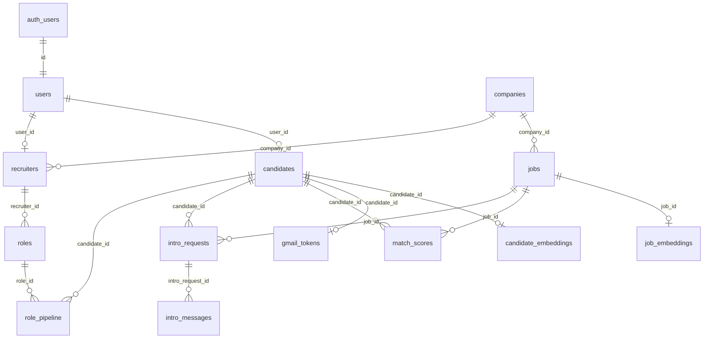

# 02 — Data Model

Source of truth: `supabase/migrations/` (70 SQL files). FastAPI uses **asyncpg** as a privileged DB role (bypasses RLS). Frontend uses **anon key + user JWT** (RLS applies). Comment in `20240101000500_rls_policies.sql`: service_role bypass is intentional; never expose service_role to the browser.

**55 public tables** inventoried. **Zero tables have RLS disabled** after `20260706210000_lock_down_rls_gaps.sql`. ~19 tables have RLS enabled with **no client policies** → deny-all for `anon`/`authenticated` (API/service-only).

---

## Architecture summary



---

## Tables (purpose, key columns, FKs, readers/writers)

### Core identity & consent

| Table | Purpose | Key columns | FKs | Writers | Readers |
|---|---|---|---|---|---|
| `users` | Thin profile 1:1 with Auth | `id`, `email`, `role`, `market` CHECK `='IN'`, `phone_verified`, `onboarding_complete`, `deleted_at` | `id` → `auth.users` | `routes/auth.py:bootstrap_user`, `routes/me.py`, `services/supabase_users.py` | SPA SELECT own; API deps |
| `consent_log` | DPDP audit | `user_id`, `purpose`, `granted`, `ip_address`, `created_at` | → `users` | `routes/me.py`, `auth.py` | Own SELECT |
| `candidates` | Candidate graph + agent state | skills, CTC, locations, `resume_path`, `linkedin_data`, `aarya_state`, `career_*`, visibility, public share fields, `market` | `user_id` → `users` | `auth.py`, `me.py`, `resumes.py`, Aarya tools | Own + recruiter opted-in SELECT |
| `candidate_embeddings` | Separated vectors | `profile_embedding`, `skills_embedding`, `resume_embedding` **vector(1536)** | → `candidates` | `services/embeddings.py:embed_candidate` | MatchingEngine SQL |
| `recruiters` | Recruiter profile + `nitya_state` | `user_id`, `company_id`, onboarding fields | → `users`, `companies` | `auth.py`, `recruiter.py` | Own SELECT (Realtime) |
| `companies` | Company graph (IN) | `name`, `domain`, `country_code` CHECK `='IN'` | — | Ingest / recruiter create | Public SELECT active |

### Jobs & matching

| Table | Purpose | Key columns | FKs | Writers | Readers |
|---|---|---|---|---|---|
| `jobs` | Scraped + recruiter-posted roles | title, description, skills, CTC, `country_code='IN'`, `source`, `apify_job_id`, `apply_url`, `canonical_fingerprint`, `recruiter_id`, `role_id`, `search_tsv` | company, recruiter, role | `job_ingester.py`, `intro_service.publish_role_to_jobs` | Public active SELECT; MatchingEngine |
| `job_embeddings` | Job vectors | `jd_embedding`, `title_embedding`, `skills_embedding` **vector(1536)** | → `jobs` | `embeddings.py:embed_job` | Matching / vector search |
| `match_scores` | Precomputed fits + bias | scores, `bias_audit`, versioning cols | → candidates, jobs; UNIQUE(pair) | `matching.py:MatchingEngine` | Candidate SELECT own; feed API |
| `match_feedback` | Behavior signals | impression/save/intro events | — | SECURITY DEFINER triggers | API-only (no client policies) |
| `candidate_job_impressions` | “New for you” events | candidate, job, event | → candidates, jobs | Matches API / UI events | Own R/W |
| `application_outcomes` | Apply funnel outcomes | candidate, job, outcome | — | Candidate R/W | Learning (heuristic, not ML) |
| `saved_jobs` | Candidate saves | candidate, job | — | Aarya / matches API | Own R/W |
| `job_applications` | Application tracking | optional `intro_id` | → candidates, jobs | API | Own R/W |
| `job_sources` | Multi-source apply URLs | job_id, source URL | → jobs | Ingester upsert | API-only |
| `job_search_buckets` | Shared inventory buckets | query fingerprints | — | Search/ingest helpers | API-only |
| `job_ingest_runs` | 24h query-skip ledger | `query_norm`, `location_norm`, `source`, `last_run_at` | — | `job_ingester.py` | API-only |
| `job_ingest_log` | Cron audit (legacy) | — | — | **No Python writer found** | `service_role` policy only |
| `title_expansions` | Title synonym cache | — | — | Search pipeline | API-only |

### Intros & email

| Table | Purpose | Key columns | FKs | Writers | Readers |
|---|---|---|---|---|---|
| `intro_requests` | R5 handshake | `direction`, `status` (incl. `draft_ready`, `sending`, `failed`), `draft_email`, Gmail IDs | candidate, job, HM, recruiter, role | `intro_service.py`, Nitya tools, `intros.py` | Candidate + recruiter SELECT; Realtime |
| `intro_messages` | Post-accept chat | body, sender | → intro_requests | Intro chat API | Parties SELECT; Realtime |
| `hiring_managers` | External HM contacts | email, LinkedIn, enrich status | → companies | `hm_enricher.py`, Nitya | API-only (no policies) |
| `gmail_tokens` | Encrypted OAuth tokens | refresh/access encrypted | → candidates UNIQUE | `gmail_oauth.py:save_oauth_tokens` | Own via candidate ownership |
| `recruiter_invites` | Email CTA for unregistered HMs | email, role/job | — | Intro create | Invitee / recruiter SELECT |

### Agents & chat

| Table | Purpose | Writers | Readers |
|---|---|---|---|
| `agent_actions` | R7 action counter | Aarya/Nitya `_write_action` | Own SELECT; Realtime |
| `conversations` / `messages` | Aarya/Nitya chat | `routes/chat.py`, recruiter chat | Candidate-scoped SELECT |
| `voice_sessions` | Voice/mock bookings | `routes/voice.py`, `voice_sessions.py` | **RLS enable, no policies** — FE count via Supabase always empty |
| `mock_interviews` | Mock interview sessions | mock_interview routes | Candidate R/W |
| `public_profile_chats` / `*_messages` | Anonymous `/p/{slug}` chat | `public_profile_chat.py` | API-only |

### Recruiter pipeline

| Table | Purpose | Writers | Readers |
|---|---|---|---|
| `roles` | Recruiter open roles | `routes/recruiter.py` | Recruiter CRUD |
| `role_versions` | Role snapshots | Recruiter publish/edit | Recruiter |
| `role_pipeline` | Candidate stages per role | `recruiter_search.py`, `intro_service`, pipeline PATCH | Recruiter + candidate own |
| `role_inbound_applicants` | Public apply inbound | `public_profiles.py:create_inbound_applicant` | Recruiter roles |
| `recruiter_searches` | Search audit | `recruiter_search.py` | Recruiter own |
| `match_audits` | Bias audit admin | Matching paths | Admin only |
| `placements` | Manual billing placements | Admin | Admin |

### Async / caches / compliance

| Table | Purpose | Notes |
|---|---|---|
| `background_jobs` | Durable job queue | RLS on, no client policies; `background_jobs.py` |
| `otp_verifications` | Phone OTP state (PK phone) | Service-only |
| `notifications` | In-app notifications | Own read/update |
| `whatsapp_messages` | MSG91 audit | Own read |
| `dpdp_export_jobs` | Export/purge queue | Own insert/read |
| `resumes` | Uploaded/parsed CVs | API writes; own SELECT |
| `career_paths`, `career_path_definitions`, `career_path_pool_jobs`, `career_path_resumes` | Career path graph | Mixed; some deny-all RLS |
| `job_application_kits`, `tailored_resumes`, `learning_roadmaps` | Apply assets | Candidate R/W (roadmaps deny-all client) |
| `resume_parse_cache`, `firecrawl_url_cache` | Idempotent caches | API-only; Firecrawl policy `USING (false)` |
| `web_push_subscriptions` | Push endpoints | Own R/W |
| `api_rate_limits` | Distributed rate limits | API-only |

---

## RLS policies (verbatim excerpts + plain language)

Policy SQL evolved across migrations; below are the **effective intent** policies as of the late robustness migration chain (`20240101000500`, `20260610103000`, `20260708160000`, `20260713160000`, `20260715180000`). Full SQL lives in those files.

### `users`

```sql
CREATE POLICY "users: read own row"
  ON public.users FOR SELECT
  USING (auth.uid() = id AND deleted_at IS NULL);

CREATE POLICY "users: update own row"
  ON public.users FOR UPDATE
  USING (auth.uid() = id AND deleted_at IS NULL);

CREATE POLICY "users: admin read all"
  ON public.users FOR SELECT
  USING (auth.user_role() = 'admin');

CREATE POLICY "users: insert own row"
  ON public.users FOR INSERT
  WITH CHECK (id = auth.uid());
```

**Plain language:** A user can see/update only their non-deleted row; can insert their own id on signup bootstrap; admins can read all.

### `candidates` (final recruiter read)

```sql
CREATE POLICY "candidates: read own" ... USING (user_id = auth.uid() AND deleted_at IS NULL);
CREATE POLICY "candidates: update own" ... USING (user_id = auth.uid());
CREATE POLICY "candidates: insert own" ... WITH CHECK (user_id = auth.uid());

CREATE POLICY "candidates: recruiter read opted in"
  ON public.candidates FOR SELECT
  USING (
    EXISTS (
      SELECT 1 FROM public.users
      WHERE id = auth.uid() AND role = 'recruiter' AND deleted_at IS NULL
    )
    AND is_active = TRUE
    AND share_with_recruiters = TRUE
    AND visibility <> 'private'
    AND deleted_at IS NULL
  );
```

**Plain language:** Candidates own their row. Recruiters may **read** (not write) candidates who opted into recruiter sharing and are not private/inactive.

### `jobs`

```sql
CREATE POLICY "jobs: public read active"
  ON public.jobs FOR SELECT
  USING (is_active = TRUE AND country_code = 'IN' AND deleted_at IS NULL);

CREATE POLICY "jobs: recruiter/admin write"
  ON public.jobs FOR INSERT
  WITH CHECK (auth.user_role() IN ('recruiter', 'admin'));
```

**Plain language:** Anyone authenticated can read active India jobs; only recruiters/admins insert via PostgREST (API still writes via asyncpg).

### `match_scores`

```sql
CREATE POLICY "match_scores: read own"
  ON public.match_scores FOR SELECT
  USING (candidate_id IN (SELECT id FROM public.candidates WHERE user_id = auth.uid()));
```

**Plain language:** Candidates read their scores only; all writes via API.

### `intro_requests` / `intro_messages`

- Candidate: read/insert own intros (via `candidates.user_id`).
- Recruiter: read where `recruiter_id` matches their `recruiters` row.
- Messages: either party on the intro can SELECT.

**Plain language:** Intro handshake rows are visible to the two parties; creates go through API; Nitya/status transitions use privileged Postgres.

### `gmail_tokens`

Own read/write via candidate ownership of `candidate_id`.

### `agent_actions` / `notifications` / `saved_jobs` / `job_applications`

Own-user scoped SELECT (and insert where specified).

### `job_ingest_log`

```sql
CREATE POLICY "service_role_full_access_job_ingest_log"
  ON public.job_ingest_log
  USING (auth.role() = 'service_role');
```

### `career_path_resumes`

```sql
CREATE POLICY "career_path_resumes: service role all"
  ON public.career_path_resumes FOR ALL
  USING (auth.role() = 'service_role');
```

### `firecrawl_url_cache`

```sql
CREATE POLICY "firecrawl_cache: service only"
  ON public.firecrawl_url_cache
  FOR ALL
  USING (false)
  WITH CHECK (false);
```

**Plain language:** PostgREST clients see nothing; privileged Postgres (asyncpg) still bypasses RLS.

### Storage (`storage.objects`) — `20240101000700_storage_buckets.sql`

Buckets `resumes`, `avatars`, `tailored-resumes` (private).

```sql
CREATE POLICY "resumes: candidate upload" ...;  -- folder = auth.uid()
CREATE POLICY "resumes: candidate read own" ...;
CREATE POLICY "resumes: service read all"
  ON storage.objects FOR SELECT
  USING (bucket_id = 'resumes' AND auth.role() = 'service_role');
```

---

## Tables WITHOUT RLS enabled

**None** at the tip of the migration chain. Historical gap existed for P15 tables until `20260610103000_enable_rls_p15_tables.sql` / `20260706210000_lock_down_rls_gaps.sql`.

### RLS enabled + zero client policies (deny-all for browser)

`candidate_embeddings`, `job_embeddings`, `hiring_managers`, `voice_sessions`, `otp_verifications`, `match_feedback`, `background_jobs`, `learning_roadmaps`, `career_path_definitions`, `career_path_pool_jobs`, `public_profile_chats`, `public_profile_chat_messages`, `resume_parse_cache`, `job_ingest_runs`, `title_expansions`, `job_sources`, `job_search_buckets`, `api_rate_limits` (and similar).

---

## Service-role / RLS bypass

| Mechanism | Where |
|---|---|
| **asyncpg pool as DB owner** | Primary API path — bypasses RLS entirely |
| `supabase_service_key` PostgREST | `deps.py` JWT validate; `supabase_users.py`; `supabase_auth_admin.py` |
| Storage service client | `routes/resumes.py`; `background_jobs.py` download |
| Explicit `auth.role() = 'service_role'` policies | `job_ingest_log`, `career_path_resumes`, storage resumes |
| Admin scripts | `api/scripts/seed_marketplace_demo.py`, `reset_all_users.py` |

**Frontend:** only `NEXT_PUBLIC_SUPABASE_ANON_KEY` (`app/src/lib/supabase/env.ts`). No service key in `app/` or `web/`.

---

## Direct DB writes from frontend

**None found.** No `.from(...).insert/update/upsert/delete` in `app/` or `web/`. Frontend Supabase usage is Auth + SELECT (dashboard/onboarding) + Realtime subscriptions. Mutations go through FastAPI (`app/src/lib/api/*`).

**Caveat:** Dashboard SELECT on `voice_sessions` cannot return rows under current RLS (no policies).

---

## pgvector setup

| Table | Columns | Dim | Index | Similarity |
|---|---|---|---|---|
| `candidate_embeddings` | `profile_embedding`, `skills_embedding`, `resume_embedding` | **1536** | HNSW `vector_cosine_ops`, `m=16`, `ef_construction=200` | Cosine via `<=>` (distance); API uses `1 - (a <=> b)` |
| `job_embeddings` | `jd_embedding`, `title_embedding`, `skills_embedding` | **1536** | Same HNSW params | Same |

Model: `openai/text-embedding-3-small` via OpenRouter (`embeddings.py`).

**How similarity queries are filtered:**

1. Jobs: `is_active`, `deleted_at IS NULL`, India/`country_code` visibility rules in MatchingEngine SQL.
2. Persona pool / persist gates in `match_quality.py` (title affinity, domain multiplier, `MIN_PERSIST_SCORE`).
3. Feed applies `DEFAULT_FEED_MIN_SCORE` and hard constraints (`ranking.passes_hard_constraints`).
4. Hybrid retrieval also uses FTS `jobs.search_tsv` (GIN) — not vectors — fused via RRF in ranking/search paths.

No other `vector(...)` columns in migrations.

---

## Discrepancies

1. `job_ingest_log` exists with RLS/`service_role` policy and a cleanup cron, but **no API writer** — live ledger is `job_ingest_runs`.
2. Migration `20260710230000` attempts `jobs.role_id text` for occupation taxonomy while a UUID `role_id` FK to `roles` already exists — `IF NOT EXISTS` skips; taxonomy column likely never added.
3. India CHECK/`country_code` was temporarily relaxed for multi-market then **forced back to IN** in `20260715180000` — docs that still describe multi-market are stale.
4. CLAUDE.md R16 “no direct DB writes from frontend” holds for mutations; **direct SELECTs** still occur on dashboard/onboarding.

---

## Unverified — needs human confirmation

1. Live Supabase project’s actual applied migration tip vs repo (drift).
2. Whether Realtime publication lists match what the SPA subscribes to in production.
3. Whether backup PITR is enabled on the Supabase plan (not in migrations).
