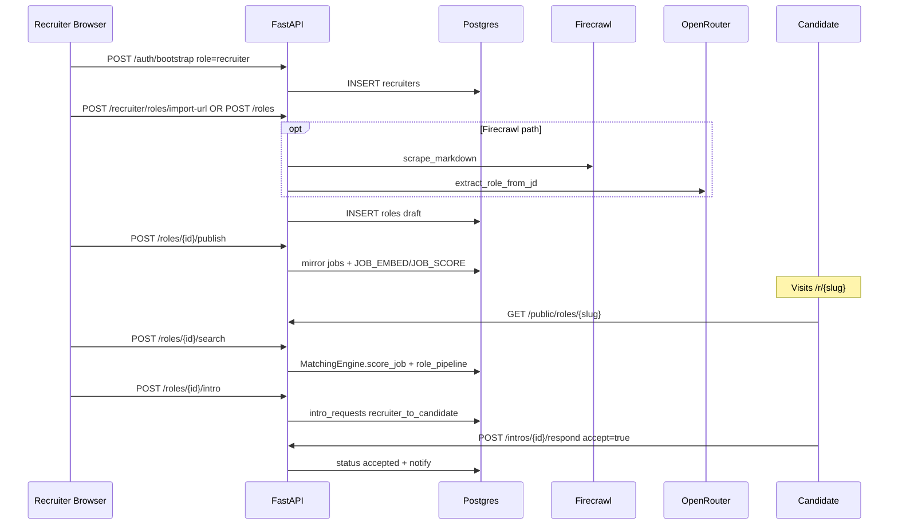

# 04 — Recruiter End-to-End Trace

Recruiter path from signup through published role, public apply page, MatchingEngine search, pipeline, and in-app intro/accept.

---

## 1. Signup / role switch

| | |
|---|---|
| **Signup** | Same OAuth/email as candidate with `?role=recruiter` (`SignupForm.tsx` ~47–50, ~412–414) |
| **Bootstrap** | `auth.py:bootstrap_user` else-branch (~422–447): `INSERT recruiters ... ON CONFLICT DO NOTHING` |
| **Destination** | New recruiter → `/recruiter/onboarding` (`post-auth-destination.ts` ~6–7) |
| **Role switch** | `POST /api/v1/auth/role` (`auth.py` ~481–513) — requires both profile flags; flips `users.role` only |
| **Client** | `app/src/lib/api/role.ts:switchActiveRole`; gate `can_switch_roles` on `/auth/me` |
| **Gate UI** | `RecruiterGate` redirects incomplete → `/recruiter/onboarding` |

**DB:** `users.role`, `recruiters` row.
**Failure:** Missing dual profile → role switch rejected.
**Progress:** Standard auth callback UX (no Realtime).

---

## 2. JD creation — manual form AND URL import

### UI

- `RecruiterOnboardingFlow.tsx` modes `form` | `import` (~43, ~173–196).
- Also `/recruiter/roles/new` same import pattern.
- Finish: `updateRecruiterProfile` + `createRole({ title, company_name, location_city, jd_text })` (~119–128).
- Route: skip intake if JD ≥40 chars → `/brief`, else `/intake` (~139–144).

### URL import API

| | |
|---|---|
| **Route** | `POST /api/v1/recruiter/roles/import-url` — `recruiter.py` (~543–643) |
| **Service** | `services/role_jd_fetch.py:fetch_role_from_url` |

**Logic:** HTML/JSON-LD/Ashby/Greenhouse parse first; **Firecrawl fallback** `_import_via_firecrawl` (~883–943, ~1034–1036) when key configured; optional OpenRouter `extract_role_from_jd` when JD long enough. Returns structured fields — **no DB write** until create.

**Failure:** `RoleImportError` → HTTP 422; Firecrawl fail logged → HTML path or error.

### Manual create

| | |
|---|---|
| **Route** | `POST /api/v1/recruiter/roles` — `recruiter.py` (~651–812) |

**DB writes:** company upsert; `INSERT roles` `status='draft'`; optional extraction apply; `INSERT conversations` (Nitya intake).
**External:** OpenRouter when `jd_text >= 40`.

---

## 3. Publish

| | |
|---|---|
| **Route** | `POST /api/v1/recruiter/roles/{role_id}/publish` — `recruiter.py` (~1739–1771) |
| **Service** | `intro_service.publish_role_to_jobs` (~787+) |

**Behavior:**

- `enable_public_listing` → public slug/URL.
- Mirror into `jobs` (insert/update) with recruiter/role linkage, ~60-day expiry.
- Enqueue `JOB_EMBED` + `JOB_SCORE`.

**Failure:** Incomplete role fields → API validation errors. Unpublished roles cannot create recruiter→candidate intros (409 `role_not_published`).

**Progress:** UI navigation to role detail; candidates can then match + Request Intro.

---

## 4. Public `/r/{slug}` apply page

| | |
|---|---|
| **Page** | `app/src/app/r/[slug]/page.tsx` |
| **GET** | `GET /api/v1/public/roles/{slug}` — `public_profiles.py` (~171–177) |

**Current UX (as implemented):** Marketing apply CTA. “Apply for this job” (~197–203) routes to **signup/signin** with `from` deep-link — **does not** submit an in-page resume form.

**Inbound apply API still exists:** `POST /public/roles/{slug}/apply` (~180–230) — Form `full_name`/`email`/`resume` → parse → `create_inbound_applicant` → `role_inbound_applicants` (scored vs brief). Rate-limited; unauthenticated. Used by API/integrations; page is account-first.

---

## 5. Candidate search via MatchingEngine

| | |
|---|---|
| **Route** | `POST /api/v1/recruiter/roles/{role_id}/search` — `recruiter.py` (~1536–1574) |
| **Impl** | `recruiter_search.search_candidates_for_role` (~234–341) |

**Steps:**

1. `ensure_role_scoring_job` — mirror role → scoring job if needed.
2. `MatchingEngine.score_job(job_id)` — score candidates against that job.
3. `rank_candidates_for_job`.
4. Upsert each into `role_pipeline` `stage='search'`.
5. Log `recruiter_searches` row.

**Failure / empty:** Diagnostic messages when unpublished / no matches (~276–284).

**Progress:** Request/response only — not Realtime for search results.

---

## 6. `role_pipeline` population

| Source | Stage | Where |
|---|---|---|
| Role search | `search` | `recruiter_search.py` ~296–312 |
| Recruiter→candidate intro | `intro_requested` | `intro_service.create_recruiter_intro` ~660–671 |
| Recruiter accepts candidate intro | `intro_made` | `recruiter_respond_intro` ~1837–1846 |
| Manual moves | PATCH | `move_pipeline_candidate` ~1627+ |
| Inbound applicants | Union at read | `get_pipeline` ~1584–1624 (`role_inbound_applicants`) |

`GET /roles/{id}/pipeline` unions pipeline rows + inbound applicants.

---

## 7. In-app intro to a candidate

| | |
|---|---|
| **Route** | `POST /roles/{role_id}/intro` |
| **Service** | `intro_service.create_recruiter_intro` (~580–698) |

**DB:** `INSERT intro_requests` `direction='recruiter_to_candidate'`, `status='pending'`; pipeline → `intro_requested`.

**External:** `notify_recruiter_approach_to_candidate` (email/in-app).

**Nitya:** **Noops** this direction (`NityaIntroHandler.handle` ~114–116) — in-app only.

**Failure:** Unpublished role → 409.
**Progress:** Candidate Realtime intros list.

---

## 8. Candidate accept flow

| | |
|---|---|
| **Route** | `POST /api/v1/intros/{id}/respond?accept=true|false` — `intros.py:respond_to_intro` (~402–477) |
| **UI** | `IntrosList.respond` (~110–126) |

**Behavior:** Updates only `direction='recruiter_to_candidate'` + `status='pending'` → `accepted` | `declined`; lifecycle notify.

**Recruiter side of candidate→recruiter intros:** `POST /recruiter/intros/{id}/respond` (~1797–1846) — on accept, pipeline → `intro_made`.

**Post-accept:** `intro_messages` + Realtime (`IntroChat.tsx`).

---

## Cross-cutting progress

| Signal | Use |
|---|---|
| Supabase Realtime | Intro inbox status; some pipeline UI |
| HTTP request/response | Role search, publish, import |
| Nitya recruiter chat | Separate plain LLM intake (`recruiter_chat.py`) — not LangGraph, not intro Gmail |

---

## Discrepancies

1. Public `/r/{slug}` page UX is **account redirect**, while inbound apply endpoint still exists — product docs that describe “public apply form on the page” overstate the SPA.
2. Docs call Nitya “recruiter AI”; recruiter JD intake is `recruiter_chat.py` (plain `ainvoke`); HM cold-email pipeline is separate and only for `candidate_to_hm`.
3. Firecrawl is optional — import works without it for structured ATS HTML, but general career pages may fail harder without the key.

---

## Unverified — needs human confirmation

1. Whether production recruiters regularly use import-url vs manual form (no analytics wiring verified here).
2. Whether public rate-limit table `api_rate_limits` is effective under real traffic on `/public/roles/*/apply`.
