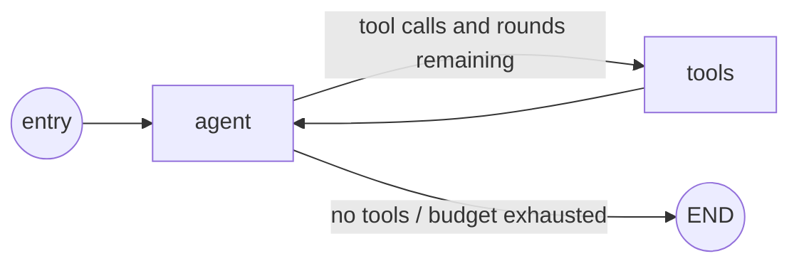
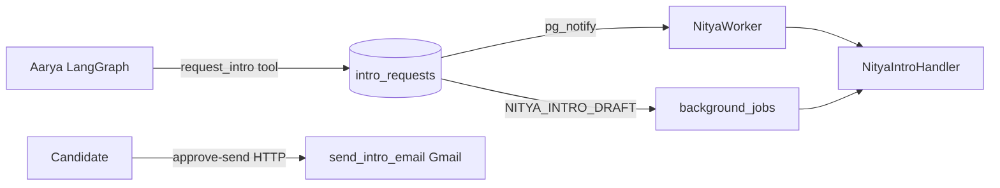

# 06 — Agent Architecture

Documents Aarya (LangGraph) and Nitya (intro LISTEN pipeline + separate recruiter chat). Confirms DB-only handshake (R5).

---

## Aarya (candidate agent) — LangGraph

**Files:** `api/src/hireloop_api/agents/aarya/agent.py`, `tools.py`
**Invoker:** `routes/chat.py` → `get_aarya_graph` / `.astream`

### Graph structure — `build_aarya_graph`



- Nodes: `agent` (`agent_node`), `tools` (`tools_node`)
- Conditional edge: `should_continue` / `route_after_agent` → `tools` | `END`
- Tool budgets: `MAX_VOICE_TOOL_ROUNDS=1`, `MAX_TEXT_TOOL_ROUNDS=3`
- **No LangGraph checkpoint** — request-scoped graph; module docstring states no hidden in-process checkpoint

### State schema — `AaryaState`

`messages` (add_messages), `user_id`, `session_id`, `action_count`, `tool_rounds`, `ui_job_cards`, `voice_mode`, `hinglish_detected`, `memory`, `known_facts`, `open_questions`, `profile_completeness`, `prefetched_jobs`, `candidate_display_name`, `career_path_*` fields.

### Tools (`tools.py` + `TOOL_DEFINITIONS` in `agent.py`)

| Tool | Signature | What it does |
|---|---|---|
| `profile_read` | `(db, user_id, session_id)` | Load candidate profile fields |
| `job_search` | `(db, user_id, session_id, query_text, skills_filter=None, location_city=None, ctc_min=None, remote_preference=None, limit=10, exclude_job_ids=None, settings=None)` | Recall + rank + optional auto-ingest |
| `update_job_preferences` | `(db, user_id, session_id, remote_preference=None, open_to_relocation=None, location_scope=None)` | Persist search prefs |
| `update_profile` | `(db, user_id, session_id, **fields)` | Persist profile facts |
| `prioritize_career_path` | `(db, user_id, session_id, title)` | Lock career-path focus |
| `build_career_path` | `(db, user_id, session_id, settings)` | Generate/update career path |
| `get_match_score` | `(db, user_id, session_id, job_id)` | Score one job |
| `analyze_resume` | `(db, user_id, session_id)` | Resume analysis |
| `analyze_pasted_jd` | `(db, user_id, session_id, jd_text, job_id=...)` | JD vs CV |
| `request_intro` | `(db, user_id, session_id, job_id, hiring_manager_id=None)` | INSERT `intro_requests` (DB only) |
| `direct_apply` | `(db, user_id, session_id, job_id, apply_url)` | Record direct apply |
| `save_job` | `(db, user_id, session_id, job_id)` | Saved jobs |
| `prepare_application_kit` | `(db, user_id, session_id, settings, job_ids=None, job_id=None)` | Kit generation enqueue |

Each writes `agent_actions` via `_write_action`.

### System prompts — full contents location

| Constant | Location | Contents |
|---|---|---|
| `AARYA_SYSTEM_PROMPT` | `agent.py:58-182` | Full prompt: personality, tool list, job-search order, India rules, reply structure, memory. Verbatim in source (starts “You are Aarya, Hireschema's AI career partner…”) |
| `AARYA_VOICE_PROMPT` | `agent.py:187-223` | Appended for voice: phone-screen persona, no markdown/emoji, 1 tool round |
| Turn guidance | `build_turn_context_prompt` (~451–591) | Injected in `agent_node` |

(Full prompt strings are long; treat the source lines as canonical — reproduced in audit exploration and in file at those lines.)

### Conversation persistence

- Tables: `conversations`, `messages`
- `chat.py`: INSERT human message before stream; `_persist_assistant_reply` after; history capped (~12); cross-session `memory` / `known_facts` injected from chat service
- Graph itself does **not** checkpoint

### `agent_actions` → Realtime UI

- Writer: `_write_action` in Aarya (and Nitya) tools
- Frontend: `app/src/lib/hooks/useAgentActionsRealtime.ts` — channel `agent-actions:{sessionId}`, `postgres_changes` INSERT filtered by `session_id`
- UI: `ChatInterface.tsx` (“Aarya performed N actions”)

### Voice path (Deepgram → same graph)

```text
mic → POST /api/v1/voice/stt (Nova-3) or WS /voice/stream (live)
   → same chat LLM pipeline (voice_mode=True → AARYA_VOICE_PROMPT, 1 tool round)
   → POST /api/v1/voice/tts (Aura, settings.deepgram_tts_model)
```

Refs: `routes/voice.py`; `services/voice/deepgram_stt.py`, `deepgram_tts.py`, `deepgram_live.py`. Fallback to browser Web Speech if no Deepgram key.

---

## Nitya — intro pipeline (not LangGraph for intros)

### Intro handshake

**Files:** `agents/nitya/agent.py`, `tools.py`
**Startup:** `main.py:lifespan` → `NityaWorker.start()` LISTENs on `intro_requests`.

**Structure — sequential pipeline in `NityaIntroHandler.handle` (not StateGraph):**

```text
lookup_intro_request → enrich_hiring_manager → draft_intro_email → status=draft_ready
  (send happens later via approve-send HTTP → send_intro_email)
```

Skips non-`candidate_to_hm` directions (in-app noop).

### System prompt (full)

`NITYA_SYSTEM_PROMPT` (`agent.py:44-60`):

```
You are Nitya, Hireschema's AI that helps candidates get warm intros to hiring managers.

Your sole job when activated is to:
1. Read the full intro context (candidate profile + job + hiring manager)
2. Check the HM has a verified email (enrich if needed)
3. Draft a warm, personalised intro email from the candidate's POV
4. Send via the candidate's Gmail (never via SendGrid or your own email)

Rules you NEVER break:
- Never send without a verified HM email
- Never send if candidate has no Gmail token connected
- Never impersonate anyone — the email is FROM the candidate, signed by the candidate
- Always write the email as if the candidate wrote it themselves
- Keep emails short: 3-4 paragraphs max
- End every email with a low-pressure call-to-action: a quick 30-min chat
```

**Note:** Step 4 in the prompt describes send-on-activate; **handler code stops at draft** — send is candidate approve-send. Flagged under Discrepancies.

Draft LLM prompting is also inside `draft_intro_email` in `tools.py` (SystemMessage/HumanMessage).

### Tools

| Tool | Signature | Role |
|---|---|---|
| `lookup_intro_request` | `(db, user_id, session_id, intro_id)` | Load context |
| `enrich_hiring_manager` | `(db, user_id, session_id, hm_id, apify_token, neverbounce_api_key)` | Apify + NeverBounce |
| `draft_intro_email` | `(db, user_id, session_id, intro_id, intro_context, llm_client)` | LLM draft → DB |
| `claim_intro_for_send` | `(db, *, intro_id, candidate_id)` | Atomic claim → `sending` |
| `release_intro_send_failure` | `(db, *, intro_id, error_message)` | Release claim |
| `send_intro_email` | `(db, user_id, session_id, intro_id, candidate_id, hm_email, hm_name, subject, body_html, body_text, google_client_id, google_client_secret, *, already_claimed=False)` | Gmail send |
| `update_intro_status` | `(db, user_id, session_id, intro_id, new_status, error_message=None)` | Status transitions |

### Recruiter intake chat (separate)

`agents/nitya/recruiter_chat.py` — plain `ChatOpenAI.ainvoke`, **not** LangGraph.
Prompts: `NITYA_RECRUITER_PROMPT`, `NITYA_POST_BRIEF_PROMPT`. Persistence via `conversations` (`agent='nitya'`) + `log_nitya_action` → `agent_actions`.

---

## LISTEN loop, missed NOTIFY, recovery

**NOTIFY trigger:** `notify_intro_requested()` → `pg_notify('intro_requests', json)` on INSERT (`20240101000300_intros_and_hm.sql`).

**Low-latency path:** `NityaWorker._on_notify` → advisory lock → `NityaIntroHandler.handle`.

**If listener is down when NOTIFY fires:** NOTIFY is **not durable** — the event is lost for LISTEN.

**Recovery (yes, via queue, not re-LISTEN sweep):**

1. `_enqueue_nitya_intro` in `intro_service.py` queues `NITYA_INTRO_DRAFT` (`max_attempts=5`). Comment: LISTEN remains low-latency wake-up.
2. `_handle_nitya_intro_draft` in `background_jobs.py` runs the same handler; if advisory lock held by LISTEN worker, **raises to retry**; skips terminal statuses.
3. Exhausted attempts → intro status moved toward failed/declined path with error message.

**Not present:** No “scan all pending intros and re-NOTIFY” sweep on LISTEN reconnect. LISTEN connection keepalive/reconnect sleeps ~5s on error. Retention sweeps nudge candidates — they do not re-run drafting.

---

## Agent ↔ agent HTTP/RPC — confirmation

**No direct Aarya↔Nitya HTTP/RPC found.**

- Zero `httpx` / agent HTTP clients under `agents/aarya` or `agents/nitya` for cross-agent calls.
- `request_intro` docstring: DB INSERT + NOTIFY is the only Aarya→Nitya mechanism.
- `NityaIntroHandler` header: never calls Aarya directly (R5).
- Communication: `intro_requests` row → `pg_notify` + durable `background_jobs`; shared Postgres; Gmail via OAuth service.



---

## Discrepancies

1. `main.py` docstring says “LangGraph for agent state management (Aarya + Nitya)” — **only Aarya is LangGraph**; Nitya intro is a procedural pipeline; recruiter chat is plain LLM.
2. `NITYA_SYSTEM_PROMPT` claim of send-on-activate contradicts `draft_ready` + approve-send design.
3. Aarya prompt numbering duplicates step “6.” twice (cosmetic).

---

## Unverified — needs human confirmation

1. Whether production Railway always runs with `database_url` set so LISTEN worker starts (without it, only durable jobs remain).
2. Whether advisory locks behave correctly if Railway ever scales to >1 replica (config currently `numReplicas = 1`).
