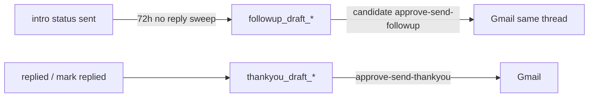

# 13 — App Quality & Robustness Improvements

Documents the quality / robustness work on branch `fix/robustness-quality-p0-p2` (merged into product trunk as of commit chain ending `e4159e0`). There is **no formal in-repo P0/P1/P2 design doc**; buckets below follow commit severity (integrity → feed/intro reliability → UX).

**Related ops checklist (not code):** `docs/MVP_RELEASE_READINESS.md`

---

## Scope (commits)

| SHA | Theme |
|---|---|
| `2805eeb` | Privacy opt-in, distributed rate limits, file security, durable Nitya wake, Singapore deploy, readiness framing |
| `c63624a` | India-only product lock (code + UX) |
| `6a16f84` | Hide stale/duplicate jobs + approve-first Gmail follow-ups / thank-yous |
| `a993671` | Resume + JD analysis cards in chat |
| `e86e552` | Atomic intro claim, India DB CHECKs, DPDP purge, phone/OTP gates, hardened health |
| `d80e819` | Job detail 500s + system bible deck collateral |
| `73d7a28` → `e4159e0` | Phone OTP wired into onboarding, then **deferred** for CV-first Activate |
| `c651515` / `664c8e2` / `a73ee7b` | Gmail OAuth UX / tagging / error surfacing |

---

## P0 — Marketplace integrity (fail-closed)

### India DB invariants + DPDP purge

**Migration:** `supabase/migrations/20260715180000_robustness_india_intro_dpdp.sql`
**Commit:** `e86e552`

| Change | Behavior |
|---|---|
| Intro status CHECK | Adds `sending` + `failed` for atomic claim / retry |
| Market normalize | Non-IN `jobs`/`companies`/`users`/`candidates` → IN; deactivate non-IN jobs |
| CHECKs | `country_code = 'IN'`, `market = 'IN'` |
| Jobs RLS | Public read: `is_active AND country_code='IN' AND deleted_at IS NULL` |
| `handle_new_user()` | Always provisions `market='IN'` |
| Soft-delete RLS | Own user rows unreadable when `deleted_at` set |
| `purge_deleted_users()` | Anonymize PII + redact message bodies |

**Code lock (in addition to DB):** `markets.py` collapses `SUPPORTED_MARKETS` to `{"IN"}`; `Settings.enabled_markets` validator strips non-IN → always `["IN"]` (`c63624a` + `e86e552`).

### Atomic intro send (no duplicate Gmail)

| Function | Role |
|---|---|
| `agents/nitya/tools.py:claim_intro_for_send` | CAS `draft_ready\|drafting\|failed` → `sending` |
| `agents/nitya/tools.py:release_intro_send_failure` | `sending` → `failed` |
| `agents/nitya/tools.py:send_intro_email` | Send only while claimed |
| `routes/intros.py:approve_and_send_intro` | Claim first, then send with `already_claimed=True` |

### Privacy opt-in (fail closed)

**Migration:** `20260713160000_candidate_privacy_opt_in.sql`
**Commit:** `2805eeb`

- Defaults: `hide_contact_public=TRUE`, `share_with_recruiters=FALSE`, `public_profile_enabled=FALSE`
- One-shot UPDATE clears sharing/publish for live candidates
- RLS `candidates: recruiter read opted in` requires `share_with_recruiters=TRUE`

**UI:** `CandidateSharingSettings.tsx` — toggles + consent via `me` APIs.
**API:** publish/share paths log `consent_log` purposes (`candidate_recruiter_sharing`, `public_profile_publish`).

### Distributed abuse / LLM rate limits

**Migration:** `20260713161000_distributed_public_rate_limits.sql` → table `api_rate_limits`
**Service:** `services/distributed_rate_limit.py:check_distributed_rate_limit` — fixed-window upsert on **HMAC identity** (raw IP never stored).

Wired via `rate_limit.check_rate_limit` (DB preferred; in-memory fallback if table unavailable). Public buckets in `public_profiles._limit_public_request`: chat `20/h`, history `60/h`, apply `8/h`.

### Upload hardening

`services/file_security.py:validate_resume_upload` / `resume_magic_ok` / `docx_archive_ok` — MIME, magic bytes, DOCX zip-bomb / traversal / encryption guards. Used by `routes/resumes.py`, `public_profiles.py`, `chat_analysis.analyze_resume_for_role`. **Always on** (no flag).

### Durable Nitya wake + ops fail-closed

- `intro_service._enqueue_nitya_intro` — `NITYA_INTRO_DRAFT` job with idempotency alongside LISTEN (`2805eeb`).
- `Settings._enforce_production_secrets` — refuse boot on default `secret_key` / `service_secret`.
- Deep health requires `X-Service-Secret` (`health.deep_health`).
- Prod JSON logging; error log if `SENTRY_DSN` missing in production.

---

## P1 — Jobs feed quality + intro outbound reliability

### Hide stale / expired scraped jobs

**Migration:** `20260713100000_deactivate_stale_scraped_jobs.sql` — pg_cron daily `30 1 * * *`: deactivate if `expires_at < NOW()` **or** `scraped_at < 45 days` (recruiter mirrors: expiry only).

**Live SQL filter:** `services/job_visibility.py`

```python
STALE_SCRAPE_DAYS = 45
LIVE_JOB_VISIBLE_SQL = live_job_visible_sql()  # expiry + scrape freshness
```

**Consumers:** `matches.py` feed/fallback/cache; `aarya/tools.py` search; `job_lexical_search`, `job_vector_search`, `matching`, `chat.py`, career market helpers.

**History exception:** `_fetch_match_history_rows` intentionally keeps expired/inactive rows so match history survives.

### Feed fallback, quality re-gate, history, find-new

**Commits:** `6a16f84`, `d80e819`

| Function (matches routes/helpers) | Role |
|---|---|
| `_supplement_market_feed` | Thin feed → cached scores → lexical fallback → starter jobs |
| `_fetch_fallback_match_rows` | Pre-embedding skill/title ranking; uses `LIVE_JOB_VISIBLE_SQL` |
| `_serialize_current_quality_cached_rows` / `_current_quality_score` | Re-run `should_persist_match` at serve time (kills stale domain mismatches) |
| `dedupe_jobs` in feed path | Collapse near-duplicates |
| `get_match_history` | Full history incl. inactive |
| `find_new_matches` | `only_new=True` via `candidate_job_impressions`; **does not** fall back to already-seen; may enqueue Apify ingest |
| `get_single_match` + `_serialize_single_match_detail` | Safe datetime/JSONB serialize; low-score still returnable with `allow_low_score=True` (fixes job-detail 500s) |

### Approve-first follow-ups + thank-yous

**Migration:** `20260713120000_intro_outbound_drafts.sql` — columns `followup_draft_email`, `followup_draft_at`, `thankyou_draft_*`, index for sweep.
**Commit:** `6a16f84`

| Module | Behavior |
|---|---|
| `intro_outbound.followup_draft_bodies` / `thankyou_draft_bodies` | Template bodies |
| `intro_outbound.create_followup_draft_row` | Idempotent draft + in-app notify |
| `intro_outbound.ensure_thankyou_draft` | Create once + notify |
| `intro_followups.run_intro_followup_sweep` | After **72h** no-reply; max 10/sweep; **drafts only — never auto-send** |
| `intros.patch_followup_draft` / `approve_and_send_followup` | Edit → Gmail same-thread; sets `nudged_at` |
| `intros.create_thankyou_draft` / `patch_thankyou_draft` / `approve_and_send_thankyou` | On reply or manual |
| `intros._summary_to_dict` | `followup_ready` / `thankyou_ready` flags |

**UI:** `IntroDraftPanel.tsx` — followup/thank-you editors + send; polls detail ~every 4s.

**R9 preserved:** All HM-facing mail still via candidate Gmail OAuth.



---

## P2 — Chat analysis UX + India product surface + Auth deferral

### Chat analysis cards (deterministic)

**Commit:** `a993671`

| File:symbol | Role |
|---|---|
| `services/chat_analysis.py:looks_like_jd` | Heuristic JD detect |
| `analyze_resume_parsed` | Gaps / strengths / version compare + actions |
| `analyze_jd_vs_profile` | Skills/seniority/domain/location scores, INR LPA, kit/intro actions |
| `analyze_resume_vs_role` | Recruiter resume↔role |
| `routes/chat_analysis.py` | `POST /me/chat/analyze-resume`, `/analyze-jd`, recruiter upload path |
| `aarya/tools.py:analyze_resume` (+ JD tool) | Agent → same service |
| `ChatAnalysisCards.tsx` | `ResumeAnalysisCard` / `JdFitAnalysisCard` + action buttons |

**No feature flag.** Heuristic only — comments note optional LLM polish later.

### India-only product lock (UX)

**Commit:** `c63624a` — markets/salary UI collapsed to India/INR; Apify locations India metros; web + app landing/copy alignment.

### Auth / phone OTP — implemented then deferred

| Commit | Intent |
|---|---|
| `73d7a28` | Wired save-phone → send-otp → verify-otp in onboarding for prod gate |
| `e4159e0` | **Removed** UI OTP step; CV-first Activate only |

**Current tip:**

- `Settings.require_phone_verification = False` (set `REQUIRE_PHONE_VERIFICATION=true` to enforce)
- `deps.get_phone_verified_user` — 403 only when flag true
- `auth.save_phone` — **auto-sets `phone_verified=TRUE`** while OTP is deferred
- OTP endpoints still exist for MSG91 when re-enabled
- `OnboardingFlow.tsx` — Activate without SMS step
- Marketing copy may still mention +91 verification → discrepancy below

### Gmail connect UX quality

- Connect success banners: `GoogleConnectResultBanner.tsx`, `GoogleConnectedBanner.tsx`
- Blank OAuth error return fixed (`664c8e2`)
- Route tags for deploy verification (`a73ee7b`)
- Post-connect success surfaced in chat (`c651515`)

---

## Implemented vs gated

| Item | Status |
|---|---|
| Live job freshness SQL + match feed/history/find-new | **Live** (stale cron needs pg_cron applied) |
| Approve-first followup/thankyou | **Live** (Gmail OAuth required to send) |
| Privacy opt-in defaults + RLS | **Live** after migration apply |
| India CHECKs / market collapse | **Live** after migration + deploy |
| Distributed rate limits | **Live** after migration; memory fallback if DB path fails |
| File security on uploads | **Live** |
| Chat analysis cards | **Live**, no flag |
| Phone OTP enforcement | **Deferred** — flag false; save-phone auto-verifies |
| Find-new Apify ingest | Needs `APIFY_TOKEN` |
| Beta smoke checklist | Process in `MVP_RELEASE_READINESS.md` |

---

## How this extends the earlier audit docs

| Earlier doc | What this branch adds |
|---|---|
| `05-matching-engine` | Serve-time quality re-gate + freshness filter around scores (not new weights) |
| `03-candidate-e2e` | Follow-up/thank-you approve-send after initial intro; history/find-new behavior |
| `02-data-model` | Outbound draft columns, `api_rate_limits`, intro `sending`/`failed`, privacy defaults |
| `08-auth-security` | File magic validation; distributed public limits; phone gate deferred |
| `09-background-jobs` | Follow-up sweep drafts; durable Nitya enqueue reinforced |

---

## Discrepancies

1. **No formal P0/P1/P2 doc in-repo** — severity buckets here are inferred from commit themes / fail-closed ordering.
2. **Marketing still mentions +91 phone verification** while onboarding OTP is skipped (`e4159e0`) and `REQUIRE_PHONE_VERIFICATION=false`.
3. **`auth.save_phone` auto-verifies** while OTP path exists — weakens the “verified phone” signal until the gate is re-enabled.
4. **Retention digests** (`retention.count_new_matches_since`) filter `is_active` + market but **do not** always use `LIVE_JOB_VISIBLE_SQL` — digests can count jobs older than 45d until cron deactivates them.
5. **Chat analysis** is heuristic only; leadership decks that imply deep LLM “analysis cards” slightly oversell.
6. Earlier audit docs (`01`–`12`) mentioned some of these pieces in passing but **did not** treat them as a shipped quality package until this file.

---

## Unverified — needs human confirmation

1. Whether all five quality migrations are applied on the production Supabase project.
2. Whether `deactivate-expired-jobs` cron shows healthy last-run after the 45-day update.
3. Whether follow-up sweep is actually firing in the retention sidecar cadence in production.
4. When MSG91 OTP will be re-enabled (`REQUIRE_PHONE_VERIFICATION=true`) for beta.
5. Whether privacy one-shot UPDATE already ran in prod (fail-closed defaults only help after migration apply).
