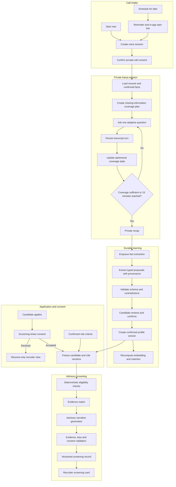

# Aarya Career Intelligence and Advisory Screening — System Overview

## Goal

Extend the existing Aarya voice experience into a trustworthy career-discovery
workflow. The live call stays responsive and writes each turn durably. Expensive
fact extraction, matching refresh, and application screening run asynchronously
through the existing Postgres queue. Candidate confirmation and consent are hard
promotion gates, and recruiters see only a versioned advisory result backed by
allowed evidence.

## Target Architecture

## Major Components

| Component | Responsibility | Existing foundation |
| --- | --- | --- |
| Voice session service | Start, schedule, resume, complete, and cancel one session row | `routes/voice.py`, `routes/voice_sessions.py`, `voice_sessions` |
| Aarya interview controller | Select the next question from missing coverage without leaving the Aarya loop | Aarya chat master loop and tools |
| Transcript store | Persist each user and assistant turn privately | `conversations`, `messages` |
| Fact proposal worker | Extract typed claims with message-level provenance | `background_jobs`, OpenRouter fallback |
| Candidate review service | Confirm, edit, reject, and version proposed facts | New FastAPI routes and tables |
| Candidate intelligence adapter | Feed confirmed facts into job search, matching, resumes, and chat | `candidate_intelligence.py` |
| Screening service | Freeze versions, build deterministic evidence, compose and validate advice | Existing matching and role criteria |
| Recruiter presentation | Display evidence, confidence, gaps, and questions | Existing recruiter pipeline |

## Architectural Improvements Over the Current Flow

1. Scheduled and instant calls update one lifecycle record instead of creating a
   booking row and a second completion row.
2. The 15-minute interview uses explicit coverage state rather than ordinary
   chat alone.
3. The current resume-text parser no longer writes voice-derived fields directly
   into the candidate record. It creates reviewable proposals.
4. Confirmed facts are versioned; screenings reference immutable candidate and
   role versions.
5. Deterministic eligibility and evidence construction run before any LLM
   narrative.
6. Screening failure degrades to the ordinary application and resume view.

## Key Tradeoffs

- Candidate review adds one step but prevents hallucinated or misunderstood
  voice content from becoming hiring evidence.
- Versioned snapshots add storage but make every recruiter assessment auditable
  and reproducible.
- A structured coverage controller constrains free-form conversation slightly,
  but improves consistency and reduces repeated questions.
- No stored audio limits later transcription reprocessing but substantially
  reduces privacy and breach risk.

