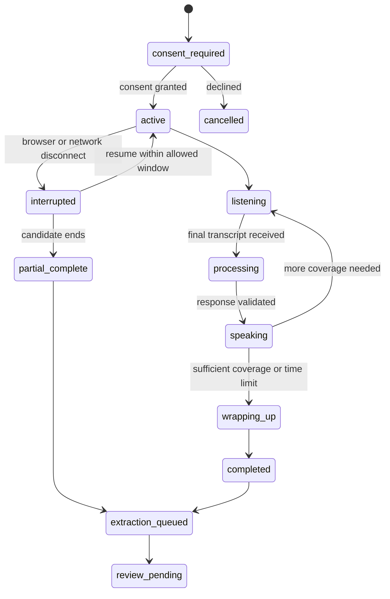

# Aarya Career Intelligence and Advisory Screening — Coordination

## Control Pattern

Use an event-driven pipeline around the existing single Aarya master loop. Do
not create a separate interviewer agent or permit Aarya and Nitya to call each
other. Post-call extraction and screening are bounded LLM jobs invoked by typed
queue handlers; they do not own conversational memory or independently perform
side effects.

## Responsibility Matrix

| Component | Responsibilities | Forbidden actions | Success output |
| --- | --- | --- | --- |
| Aarya master loop | Natural dialogue, read confirmed profile, ask next coverage question, recap | Writing confirmed facts, judging employability, using protected traits | Persisted turns and `CareerInterviewCoverage` |
| Interview policy service | Determine missing topics, time budget, repetition and sensitive-question rules | Generating arbitrary hiring conclusions | `NextInterviewFocus` |
| Fact extraction worker | Extract only candidate-stated facts and message references | Updating `candidates`, exposing transcript, inventing facts | Valid `CandidateFactProposal[]` |
| Candidate review service | Apply edits and confirmation transactionally | Confirming on the candidate's behalf | New `CandidateProfileVersion` |
| Evidence builder | Map confirmed facts/resume evidence to versioned role criteria | LLM calls, protected-trait features, treating unknown as failure | `ScreeningEvidenceMatrix` |
| Screening composer | Write concise advisory explanation and follow-up questions | Rejecting candidates, changing deterministic results | `AdvisoryScreeningDraft` |
| Screening validator | Verify evidence references, consent, versions, banned fields and confidence | Repairing unsupported claims silently | Publishable result or typed failure |
| Nitya | Help recruiter interpret published screening and manage pipeline | Reading private transcript or unconfirmed proposals | Recruiter-facing explanation from published record |

## Live Interview State Machine

## Coverage Contract

`CareerInterviewCoverage` is stored per voice session and contains:

- `schema_version`
- `covered_topics` and `missing_topics`
- `candidate_declined_topics`
- `question_history`
- `contradictions_to_clarify`
- `elapsed_seconds` and `turn_count`
- `current_focus`
- `completion_reason`

The controller selects one focus; Aarya writes the natural question. A topic is
not marked covered merely because the model asked about it—coverage requires a
candidate answer or an explicit decline.

## Queue Handoffs

| Job kind | Idempotency key | Trigger | Output |
| --- | --- | --- | --- |
| `career_interview_extract` | `career_interview_extract:{session_id}:{transcript_version}` | Session completion | Fact proposals |
| `match_embed_candidate` | Existing candidate key | Confirmed profile version | Updated embedding |
| `match_recompute_candidate` | `match_recompute_candidate:{candidate_id}:{profile_version}` | Confirmed profile version | Updated matches |
| `application_screening` | `application_screening:{application_id}:{candidate_version}:{role_version}` | Application plus share consent | Published or failed screening |

Every handler validates its current consent and source versions before writing.
Replayed events are safe because outputs have unique version-aware constraints.

## Non-Interference Rules

- Shared state moves only through Postgres records and typed queue payloads.
- Aarya cannot read screening drafts or recruiter-only notes.
- Nitya cannot read transcripts, audio fields, or unconfirmed proposals.
- A screening worker receives a frozen, minimal snapshot rather than the live
  mutable candidate row.
- Model outputs never promote themselves; deterministic validation owns every
  state transition.

