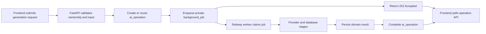

# Durable AI Operations Design

**Date:** 2026-07-22  
**Status:** Approved design  
**Product:** Hireschema candidate and recruiter application

## Problem

Hireschema currently gives ordinary authenticated API requests a 25-second client timeout. Some non-interactive AI operations legitimately take longer. Production evidence showed `POST /api/v1/career/path/generate` completing successfully in 83.4 seconds after the browser had already aborted at 25 seconds. The user saw a misleading API-unreachable error even though Railway returned `200 OK` and persisted the result.

Increasing every timeout would keep fragile HTTP connections open and would not handle refreshes, provider throttling, deploys, retries, or worker crashes. Non-interactive AI generation must therefore move to durable background operations with observable progress and recoverable results.

## Goals

- Return quickly from every non-interactive AI-generation submission.
- Persist operation state across refreshes, navigation, disconnects, and deploys.
- Prevent duplicate provider work through idempotency.
- Give users consistent progress, cancellation, retry, and completion UX.
- Classify failures accurately instead of reporting every abort as an API outage.
- Preserve existing domain tables as the source of truth for generated artifacts.
- Reuse the existing PostgreSQL `background_jobs` queue and Railway worker.
- Enforce tenant isolation and avoid exposing prompts, transcripts, secrets, or raw provider errors.

## Non-goals

- Aarya chat, live voice streaming, speech-to-text, and text-to-speech remain real-time.
- This work does not replace PostgreSQL with a separate queue product.
- The operation record does not become a second storage location for resumes, kits, career paths, or roadmaps.
- The system cannot guarantee that external providers never fail. It guarantees that failures are durable, recoverable where possible, and correctly communicated.

## Scope

The durable operation contract covers non-interactive generation, including:

- Application Kit preparation
- Career path generation
- Career intelligence generation
- Tailored resume generation
- Career-path resume generation
- Learning-roadmap generation
- Resume parsing and profile extraction
- Resume and job-description analysis
- Candidate and recruiter enrichment that invokes external AI or scraping providers
- Recruiter-side generative analysis that can exceed the ordinary request budget

Existing routes that already enqueue `background_jobs` will be adapted to publish a standard operation record. Remaining synchronous routes will be converted incrementally.

## Architecture



### Queue boundary

`background_jobs` remains the internal execution queue. It owns provider payloads, attempts, scheduling, worker identity, and raw internal failure details. It is never exposed directly to candidates or recruiters.

`ai_operations` is a user-safe projection linked to a queue job. It owns tenant identity, lifecycle status, progress, safe messages, result references, and expiry. Frontend clients read only this projection through FastAPI.

### Priority lanes

- **Interactive generation:** kits, paths, intelligence, resumes, roadmaps, and requested analyses
- **Enrichment:** resume parsing, LinkedIn enrichment, and external-data processing
- **Bulk:** ingestion, embeddings, scheduled recomputation, and backfills

Interactive generation is claimed ahead of enrichment and bulk work. Concurrency remains bounded so provider limits and database capacity are respected.

## Data model

Create `public.ai_operations` with:

- `id UUID PRIMARY KEY DEFAULT gen_random_uuid()`
- `user_id UUID NOT NULL`
- nullable `candidate_id UUID` and `recruiter_id UUID`
- `kind TEXT NOT NULL`
- nullable `resource_type TEXT` and `resource_id UUID`
- nullable `background_job_id UUID`
- `idempotency_key TEXT NOT NULL`
- `status TEXT NOT NULL` constrained to `queued`, `running`, `succeeded`, `failed`, `cancelled`
- `progress_percent SMALLINT NOT NULL DEFAULT 0` constrained to 0–100
- `stage TEXT NOT NULL`
- `message TEXT NOT NULL`
- nullable `result_type TEXT` and `result_id UUID`
- nullable `error_code TEXT` and `error_message TEXT`
- `attempts INTEGER NOT NULL DEFAULT 0`
- nullable `started_at`, `completed_at`, and `expires_at`
- `created_at`, `updated_at`, and nullable `deleted_at`

Indexes cover owner/status recency, background-job lookup, expiry cleanup, and active idempotency. A partial unique index prevents more than one active operation for the same idempotency key.

RLS permits authenticated users to select their own non-deleted operations. Creation, lifecycle mutation, and result linking occur only through the service role/API. Cancellation uses an ownership-checked API endpoint rather than direct database writes.

## Lifecycle invariants

- Valid transitions are `queued → running → succeeded|failed|cancelled` and `queued → cancelled`.
- Terminal operations never return to a non-terminal state.
- Progress never decreases within one attempt.
- A succeeded operation has a valid result reference or an explicitly result-less operation kind.
- A failed operation has a stable error code and user-safe message.
- Cancellation is best effort once an external provider call has started; a late provider response is discarded if the operation is terminal.
- Domain result persistence and operation success are committed atomically where they share a transaction.
- Worker crashes leave recoverable queue state; stale running jobs are reclaimed under the existing queue policy.

## API contract

### Submit

Existing feature endpoints will validate the request, create or reuse an operation, enqueue its job, and return:

```json
{
  "operation_id": "uuid",
  "status": "queued",
  "status_url": "/api/v1/ai-operations/uuid",
  "retry_after_ms": 1500
}
```

The response status is `202 Accepted`. If the domain result already exists and is reusable, the endpoint may return the existing feature response immediately. Repeated equivalent submissions return the active operation instead of enqueuing duplicate work.

### Read and list

- `GET /api/v1/ai-operations/{operation_id}` returns an owned operation.
- `GET /api/v1/ai-operations?status=active` returns the user's active operations for reload recovery.
- Terminal responses include a domain result reference, never a raw queue payload.

### Cancel and retry

- `POST /api/v1/ai-operations/{operation_id}/cancel` performs ownership checks and marks queued work cancelled.
- `POST /api/v1/ai-operations/{operation_id}/retry` creates a new attempt only for retryable terminal failures and reuses the logical idempotency scope safely.

## Progress and frontend behavior

A shared API client and operation manager will provide feature-independent polling and state recovery.

- Poll after 1.5 seconds for newly queued work.
- Back off to 3–5 seconds while work continues.
- Pause polling while the document is hidden.
- Resume by operation ID after refresh, navigation, login, or network restoration.
- Restore active operations from the list endpoint.
- Stop polling only at a terminal state or the operation's server-defined expiry.

Feature UIs show meaningful stages such as `Queued`, `Reading profile`, `Generating`, `Saving`, and `Ready`. A global AI-task indicator surfaces work that continues after the initiating page is left.

All HTTP access remains in the shared API layer. Pages do not query Supabase directly.

## Error model

Stable user-facing codes include:

- `network_unreachable`
- `provider_timeout`
- `provider_rate_limited`
- `provider_unavailable`
- `invalid_input`
- `insufficient_profile`
- `permission_denied`
- `job_expired`
- `cancelled`
- `internal_error`

Provider throttling, timeouts, and transient infrastructure failures retry automatically with bounded exponential backoff. Invalid input, insufficient profile data, and permission failures do not retry. Raw provider bodies, stack traces, tokens, prompts, resumes, and transcripts remain in protected server logs or are omitted entirely.

Generic request failures identify the actual boundary that failed. A polling network failure is distinct from an operation failure. The UI no longer labels a completed or slow AI job as an unreachable Railway API.

## Real-time exceptions

Aarya chat, live voice, STT, and TTS remain real-time because queuing would damage conversational latency. They receive purpose-specific request deadlines, streaming/reconnect behavior, and recoverable persisted messages. A disconnected chat client can reload the completed assistant message from conversation history.

## Compatibility and rollout

1. Add the table, constraints, indexes, RLS, and operation API without changing feature responses.
2. Add worker helpers that update safe progress and terminal state.
3. Adapt already-queued features to create `ai_operations` records.
4. Deploy the backward-compatible backend and verify existing clients.
5. Add the shared frontend operation manager and recovery UI.
6. Convert synchronous non-interactive AI endpoints one feature group at a time.
7. Deploy backend support before deploying each frontend consumer.
8. Remove obsolete long synchronous client timeouts after production latency confirms no converted route still holds the request open.

During rollout, clients accept both an immediate completed feature response and a `202` operation response. This prevents backend/frontend version skew.

## Security and privacy

- Every read, cancel, and retry checks authenticated ownership.
- RLS is enabled on `ai_operations`; no anonymous policy exists.
- Queue payloads and raw failures remain service-only.
- Operation messages contain no PII, resume text, transcript content, credentials, or provider payloads.
- Soft deletion applies to operation records.
- Rate limits apply to submissions and retries per user and operation kind.
- Idempotency keys are derived server-side and cannot be used to access another tenant's work.
- Result references are re-authorized when the result is fetched.

## Verification strategy

### Backend

- Lifecycle transition and progress monotonicity unit tests
- Queue claiming, priority, retry, deadline, cancellation, and crash-recovery integration tests
- Duplicate-submission/idempotency concurrency tests
- Atomic result-and-operation completion tests
- Provider timeout, rate-limit, malformed-response, and outage tests
- IDOR and RLS tests for read, list, cancel, retry, and result access

### Frontend

- Operation response validation tests with Zod
- Adaptive polling and hidden-tab pause tests
- Refresh/reconnect recovery tests
- Duplicate-click, retry, cancel, terminal-state, and expiry tests
- Feature contract tests for immediate-result and `202` responses
- Error-copy tests proving network failure and operation failure remain distinct

### Production

- Smoke-test every converted feature with an authenticated candidate or recruiter
- Confirm submission endpoints return `202` within the ordinary request budget
- Confirm workers complete operations and persist domain results
- Confirm reload recovery and cross-page completion
- Audit Railway HTTP logs for remaining non-streaming requests over 20 seconds
- Confirm no cross-tenant operation access and no PII in status payloads

## Acceptance criteria

- No converted non-interactive AI request depends on a browser waiting for generation to finish.
- Refreshing or closing the initiating page does not lose work.
- Duplicate submissions do not duplicate active provider work.
- Provider and worker failures produce durable, classified terminal states.
- Users can recover active and completed work after reconnecting.
- Existing real-time chat and voice behavior remains responsive.
- All new database objects have RLS, soft deletion, ownership tests, and indexed access paths.
- Backend-first rollout keeps old frontend deployments functional.
